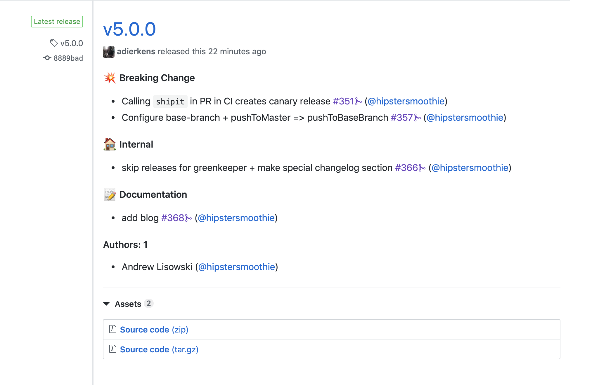

Sometimes you are working on a big feature and you know it will require a lot of changes. These types of pull requests can be a nightmare to review. Taking in all the changes at once can be overwhelming. It makes it easy to miss smaller mistakes and can make it hard to guess the intent of the changes. Multiple features, bug fixes, or even breaking changes may make up this large PR.

One way to manage this problem is by making a PR to the large PR. Other contributors can review a smaller subset of changes and also follow along with development. In previous versions of `auto`, large PRs would not be represented well in the changelog and release notes. It would only include the main PR that got merged into master as the only changelog note.

But thanks to [this PR](https://github.com/intuit/auto/pull/359) that isn't true anymore! Now when you merge one PR to another both changes will be represented in the changelog.

 /.smallImage\

_Score!_ /.has-text-centered\

---

For example in [PR #351](https://github.com/intuit/auto/pull/351) we changed what happens when you call `shipit` from a PR. Previously if you called `shipit` it would create a new release and publish it to the `latest` tag. The PR made it so `shipit` would create a canary release when run in a PR and only publish to latest from the `master` branch.

Another [contributor](https://github.com/zephraph) to the project pointed out that some users might not be using `master` as their base branch, so the `baseBranch` should be configurable.

Instead of waiting for #351 to get merged to write the `baseBranch` functionality, I could make a PR to #351 and both PRs would be represented in the changelog!

---

Now you can be a little more creative with how you manage large PR and have even more detailed changelogs.
